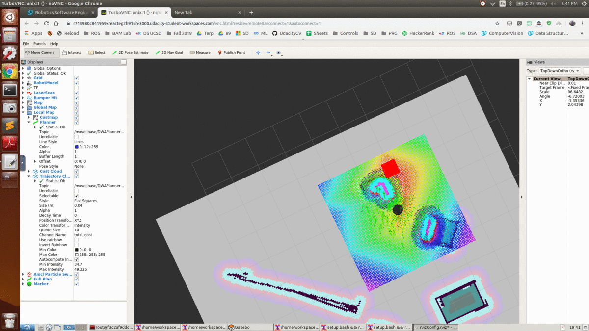

# Udacity Final Project - Home Service Robot
# Author: Sarvesh Thakur

Final Project of Udacity Robotics Software Engineer Nanodegree
  

------------------------------------------------------------------
PreRequistes to run the Project:

1) ROS - Kinetic
2) RVIZ
3) Gazebo
4) xterm
5) ROS Packages

Installation Procedure:

1) Xterm: sudo apt-get install xterm
2) ROS Packages:
	sudo apt-get install ros-kinetic-navigation
    sudo apt-get install ros-kinetic-map-server
    sudo apt-get install ros-kinetic-move-base
    sudo apt-get install ros-kinetic-amcl
3) Clone the following repositories from Github
	git clone https://github.com/ros-perception/slam_gmapping.git  
    git clone https://github.com/turtlebot/turtlebot.git  
    git clone https://github.com/turtlebot/turtlebot_interactions.git  
    git clone https://github.com/turtlebot/turtlebot_simulator.git

Running Instruction:
1) Navigate to catkin_ws/src/scripts
2) Execute home_service.sh (command: ./home_service.sh)

----------------------------------------------------------------------

Project Description:-

1) Directory Structure
```
.Home-Sevice-Robot                                        # Home Service Robot Project
├── catkin_ws                                             # Catkin workspace
│   ├── src
│   │   ├── add_markers                                   # add_markers package        
│   │   │   ├── launch
│   │   │   │   ├── view_navigation.launch   			  # launch file for home service robot demo
│   │   │   ├── src
│   │   │   │   ├── add_markers.cpp                       # source code for add_markers node
│   │   ├── pick_objects                                  # pick_objects package     
│   │   │   ├── src
│   │   │   │   ├── pick_objects.cpp                      # source code for pick_objects node
│   │   ├── rvizConfig                                    # rvizConfig package        
│   │   │   ├── rvizConfig.rviz              			  # rvizConfig file for home service robot demo  
│   │   ├── scripts                                       # shell scripts files
│   │   │   ├── add_marker.sh                             # shell script to model virtual objects  
│   │   │   ├── home_service.sh                           # shell script to launch home service robot demo  
│   │   │   ├── pick_objects.sh                           # shell script to send multiple goals  
│   │   │   ├── test_navigation.sh                        # shell script to test localization and navigation
│   │   │   ├── test_slam.sh                              # shell script to test SLAM
│   │   ├── slam_gmapping                                 # gmapping_demo.launch file
│   │   ├── turtlebot                                     # keyboard_teleop.launch file
│   │   ├── turtlebot_interactions                        # view_navigation.launch file
│   │   ├── turtlebot_simulator                           # turtlebot_world.launch file package   
│   │   ├── pgm_map_creator								  # Repositories from last project
│   │   ├── teleop_twist_keyboard						  # Repositories from last project
│   │   ├── CMakeLists.txt                                # compiler instructions
├── Screenshots                                           # Screenshot
│   ├── OverView.png									  # Overview - project execution.

```

2) Overview:

In this project, we build a Home Service Robot in ROS.

### Mapping

We created a test_slam.sh script file and launched it to manually test SLAM.

### Localization and Navigation

We used the ROS Navigation stack, which is based on the Dijkstra's, a variant of the Uniform Cost Search algorithm, to plan our robot trajectory from start to goal position.

We created a test_navigation.sh script file to launch it for manual navigation test.
Our robot was able to navigate in the environment after a 2D Nav Goal command is issued.
We created a pick_objects.sh file that sent multiple goals for the robot to reach.

The robot travels to the desired pickup zone, displays a message that it reached its destination, waits 5 seconds, travels to the desired drop off zone, and displays a message that it reached the drop off zone."

### Home Service Functions

We created a add_marker.sh file that will publish a marker to rviz.
The marker should initially be published at the pickup zone. After 5 seconds it should be hidden. Then after another 5 seconds it should appear at the drop off zone. The student should write a home_service.sh file that will run all the nodes in this project.

Home service robot was simulated as follow:

1)Initially show the marker at the pickup zone.
2)Hide the marker once your robot reach the pickup zone.
3)Wait 5 seconds to simulate a pickup.
4)Show the marker at the drop off zone once your robot reaches it.

-----------------------------------------------------------------------------------

Thank You.
